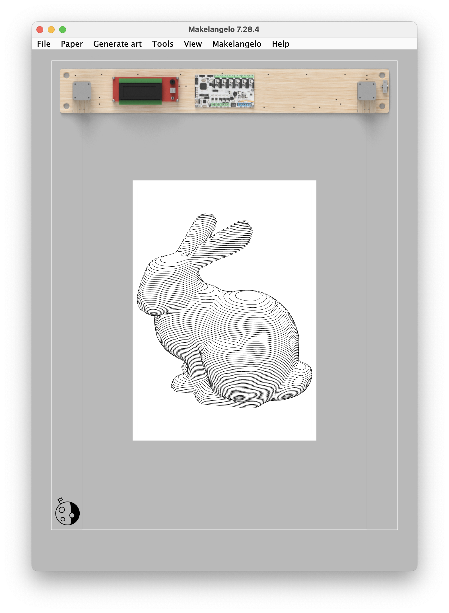

# Makelangelo Software

Makelangelo Software is a Java program that prepares art for CNC plotters.  It is especially designed for the [Makelangelo Robot](http://www.makelangelo.com/).

It pairs really well with [Makelangelo-firmware](https://github.com/MarginallyClever/Makelangelo-firmware), the code in the brain of the robot that receives instructions and moves the motors.  

## Where to go from here

**On your own**  [Reading our friendly manuals](http://mcr.dozuki.com).  Pictures and arrows and everything.  

**Together** and [join our Discord group](https://discord.gg/QtvHqAv8yp)

# Get Started developing!

Steps to get started poking the code:

1. Install The latest OpenJDK (java software)
2. Install Makelangelo Software App

Then you should be able to run the application.

## Install The latest OpenJDK

Get the Open Java Development Kit (OpenJDK) https://jdk.java.net/ .  The latest version is the "ready to use" edition.

*OSX*: Unarchive the OpenJDK tar, and place the resulting folder (i.e. jdk-12.jdk) into your /Library/Java/JavaVirtualMachines/ folder since this is the standard and expected location of JDK installs. You can also install anywhere you want in reality.

*Windows*: https://stackoverflow.com/a/52531093 _untested_

*Linux*: https://linuxize.com/post/install-java-on-ubuntu-18-04/ _untested_

## Install Makelangelo Software App

* Goto https://github.com/MarginallyClever/Makelangelo-software/
* Download this zip file: https://github.com/MarginallyClever/Makelangelo-software/archive/refs/heads/master.zip and extract it. Note the folder for later.

2 options are available for building the application:
- with Eclipse: fully graphical but long
- with Maven in a console: fast and reliable

### Eclipse IDE building
* Go to Eclipse website: https://www.eclipse.org/downloads/, choose "Eclipse IDE for Java developers" and install the latest version.
* Launch '"clipse IDE" when done and go to File > Import > Maven > Existing Maven Projects > Next > (folder from previous step) > Finish
* If you see the "Welcome!" tab, close it.
* select Run > Debug As > Java Application
* select "Makelangelo - com.marginallyclever.makelangelo" and click OK.  (It should be the top of the list)
* Wait while the progress bar in the bottom right fills up. This is a one time thing while it installs other dependencies and packages and puts everything together.
* "Errors exist...Proceed with launch?" Select Proceed.

🎉 Application should now launch.

### Console building
* Open a terminal emulator (`cmd` on Windows, `Terminal` on macOS or GNU/Linux) in the extracted folder.
* Build the application with `mvnw` (the first time, it downloads a lot of files):
  * `./mvnw clean install` on macOS or GNU/Linux
  * `mvnw.cmd clean install` on Windows
* in the `target/` folder, launch the jar file with a name like : `Makelangelo*-with-dependencies.jar`
  * double click on it OR
  * in the previously opened console, run `java -jar target/Makelangelo*-with-dependencies.jar`

🎉 Application should now launch.

## Thank you

Did this program help you?  Like Open Source software?  Want to show support?
Donate what you can to help speed up development at https://www.marginallyclever.com/product/makelangelo-software/

Makelangelo is derived from the work of Paul Fisher.  It is largely inspired by [Hektor](http://hektor.ch/) by Jürg Lehni and Uli Franke.
