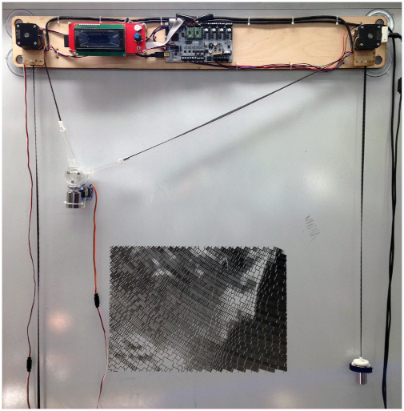

# Makelangelo Software

Makelangelo Software is a Java program that prepares art for CNC plotters.  It is especially designed for the [Makelangelo Robot](http://www.makelangelo.com/).

It pairs really well with [Marlin 3D printer firmware](https://github.com/MarginallyClever/Marlin-polargraph/commits/polargraph-2.0.x), the code in the brain of the robot that receives instructions and moves the motors.  


## Where to go from here

**On your own**  [Reading our friendly manuals](http://mcr.dozuki.com). Pictures and arrows and everything.  

**Together** and [join our Discord group](https://discord.gg/QtvHqAv8yp)

# Start!

- Buy a plotter [Makelangelo 5](https://www.marginallyclever.com/products/makelangelo-5/) or build your own;
  
- Setup [Marlin 3D printer firmware](https://github.com/MarginallyClever/Marlin-polargraph/commits/polargraph-2.0.x) with the help of the [documentation](https://www.marginallyclever.com/2021/10/friday-facts-4-how-to-marlin-polargraph/);
- Install "Makelangelo Software" on your computer to control the robot. You will find [nightly build](https://github.com/MarginallyClever/Makelangelo-software/releases/tag/Nightly) whith installer for the macOS, Linux and Windows *or* Install Makelangelo Software App from the source as described below;
  > Note: on macOS, when launching the app, you will have an error: "Makelangelo.app is damaged and can't be opened, you should move it to the trash". It can be fixed by opening a console and entering the command `sudo xattr -cr /Applications/Makelangelo.app`. This is due to [this bug](https://bugs.openjdk.java.net/browse/JDK-8276150).
- Import a picture, or a vector graphic and watch the robot drawing.

## Developper instructions

If you want to contribute to the application or just want the blending edge version of the software, follow the instructions below to install a JDK and next to download and run the app after compiling it with eclipse or Maven.

This project is written in Java and uses Swing for the graphical interface. The packaging of the application is done with Maven.

## 1. Install The latest OpenJDK

Get the [Open Java Development Kit (OpenJDK)](https://openjdk.java.net/). The minimum required version 15.

- **macOS**: Unarchive the OpenJDK tar, and place the resulting folder (i.e. jdk-17.jdk) into your `/Library/Java/JavaVirtualMachines/` folder since this is the standard and expected location of JDK installs. You can also install anywhere you want in reality.
- **Windows**: https://stackoverflow.com/a/52531093 _untested_
- **Linux**: https://linuxize.com/post/install-java-on-ubuntu-18-04/ _untested_

## 2. Grab a nightly build

Download a [nightly build](https://github.com/MarginallyClever/Makelangelo-software/releases/tag/Nightly) corresponding to the latest commit from master. Depending on your OS, double clic on the file starting with `makelangelo-nightly-` or run the following command:
```
java -jar makelangelo-nightly-XXXXX.jar
```

🎉 Application should now launch.

## 3. Install Makelangelo Software App from the source

* Goto https://github.com/MarginallyClever/Makelangelo-software/
* Download the [zip file](https://github.com/MarginallyClever/Makelangelo-software/archive/refs/heads/master.zip) and extract it *or* clone the repos with Git. Note the folder for later.

2 options are available for building the application:
- with an IDE like Eclipse: fully graphical but long
- with Maven in a console: fast and reliable

### Eclipse IDE building
* Go to Eclipse website: https://www.eclipse.org/downloads/, choose "Eclipse IDE for Java developers" and install the latest version.
* Launch "Eclipse IDE" when done and go to File > Import > Maven > Existing Maven Projects > Next > (folder from previous steps) > Finish
* If you see the "Welcome!" tab, close it.
* select Run > Debug As > Java Application
* select "Makelangelo - com.marginallyclever.makelangelo" and click OK. (It should be the top of the list)
* Wait while the progress bar in the bottom right fills up. This is a one time thing while it installs other dependencies and packages and puts everything together.
* "Errors exist...Proceed with launch?" Select Proceed.

🎉 Application should now launch.

### Console building
* Open a terminal emulator (`cmd` on Windows, `Terminal` on macOS or GNU/Linux) in the extracted folder.
* Build the application with `mvnw` (the first time, it downloads a lot of files):
  * `./mvnw clean install -DskipTests` on macOS or GNU/Linux
  * `mvnw.cmd clean install -DskipTests` on Windows
* in the `target/` folder, launch the jar file with a name like : `Makelangelo*-with-dependencies.jar`
  * double-click on it *OR*
  * in the previously opened console, run `java -jar target/Makelangelo*-with-dependencies.jar`

🎉 Application should now launch.

## Development

When launching the application, set the environnement variable `DEV` to `true` in order to get the application log on the stdout.

## Thank you

Did this program help you? Like Open Source software? Want to show support?
Donate what you can to help speed up development at https://www.marginallyclever.com/product/makelangelo-software/

Makelangelo is derived from the work of Paul Fisher. It is largely inspired by [Hektor](http://hektor.ch/) by Jürg Lehni and Uli Franke.

## Credits

- Icons from [Famfamfam silk icons](http://www.famfamfam.com/lab/icons/silk/), Creative Commons Attribution 3.0 License