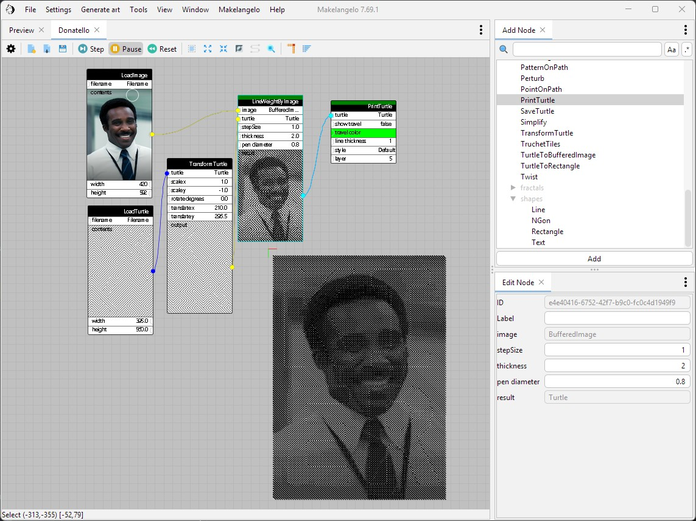

# Makelangelo Software

 

Makelangelo Software is a Java program that prepares art for CNC plotters.  It was originally designed for the
[Makelangelo Art Robot](http://www.makelangelo.com/).  It runs in Windows, OSX, and several flavors of linux.

It pairs really well with [Marlin 3D printer firmware](https://github.com/MarginallyClever/Marlin-polargraph/tree/2.1.x-polargraph), the code in the brain of the robot that receives instructions and moves the motors.  

## Installing and running
[Get the latest nightly build](https://github.com/MarginallyClever/Makelangelo-software/releases/tag/Nightly)
[How to use Makelangelo Software 7.24.0+](https://mcr.dozuki.com/Guide/1.+How+to+use+Makelangelo+Software+7.24.*/5?lang=en)

## Where to go from here
- [Join our Discord community](https://discord.gg/QtvHqAv8yp).  Share your creations, make new friends!  The best place to get support.
- Read more of [our friendly manuals](http://mcr.dozuki.com).  Pictures and arrows and everything.
- Build your own plotter and setup [Marlin 3D printer firmware](https://github.com/MarginallyClever/Marlin-polargraph/tree/2.1.x-polargraph) with the help of the [documentation](https://www.marginallyclever.com/2021/10/friday-facts-4-how-to-marlin-polargraph/).
- Buy a [Makelangelo 5](https://www.marginallyclever.com/products/makelangelo-5/) vertical plotter.

## Developers + Translators

- Translations are organized through https://crowdin.com/project/makelangelo and your help is very welcome.
- Please see the [developer getting started wiki page](https://github.com/MarginallyClever/Makelangelo-software/wiki/Getting-Started-for-Developers) for tips on setting up your local copy of the project, connecting to an IDE, and building from the console.
- Also check out the [contributing guide](https://github.com/MarginallyClever/Makelangelo-software/blob/master/CONTRIBUTING.md).

## Credits

- Icons from [Famfamfam silk icons](http://www.famfamfam.com/lab/icons/silk/), Creative Commons Attribution 3.0 License
- App icons provided by http://icons8.com.
- Ramps v1.4 drawing from [Reprap](Wikihttps://reprap.org/wiki/File:Rampsv14_wiring_psu.png), GPL v2
- Inspiration from [Kinogaki](https://app.kinogaki.com/)
- Makelangelo is derived from the work of Paul Fisher. It is largely inspired by [Hektor](http://hektor.ch/) by Jürg Lehni and Uli Franke.
- some test suite resources from [file-examples.com](https://file-examples.com/)